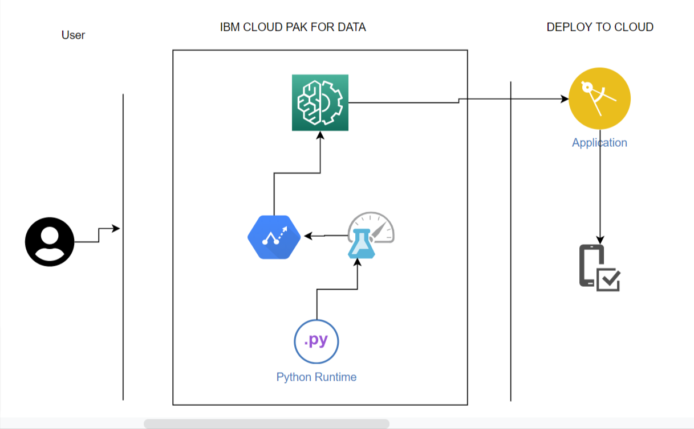

# Code-fiveters
WIT-Hackathon-idea-submission 
Theme"Zero Hunger"
## Contents

- [Submission or project name](#submission-or-project-name)
  - [Contents](#contents)
  - [Short description](#short-description)
    - [What's the problem?](#whats-the-problem)
    - [How can technology help?](#how-can-technology-help)
    - [The idea](#the-idea)
  - [Demo video](#demo-video)
  - [The architecture](#the-architecture)
  - [Long description](#long-description)
  - [Project roadmap](#project-roadmap)
  - [Getting started](#getting-started)
  - [Built with](#built-with)
  - [Contributing](#contributing)
  - [Authors](#authors)
  - [License](#license)
  - [Acknowledgments](#acknowledgments)

###  SHORT DESCRIPTION
- # Whats the problem:
Food is one of the essential element and is consumed to provide nutritional support.Food loss is the bigger category, and incorporates any edible food that goes uneaten at any stage. Edible food is discarded at every point along the food chain in retail stores, in restaurants and at our own  houses.Households are responsible for the largest portion of all food waste.
Some of the negligence caused are overbuying Groceries as there are Sales on unusual products and promotions that encourage impulse and bulk food purchases at retail stores often lead consumers to purchase items that do not fit into their regular meal plans and, therefore, spoil before they can be used, About two-thirds of food waste at home is due to food not being used before it goes bad.
 A solution is definitely required to avoid wastage of food in large  number every day for a sustainable environment.
- # How can technology help: 
       Why not develop a one stop solution to stop wastage of food at our own houses as reducing food lost or wasted means more food for all, less greenhouse gas emissions, less pressure on environment, and increased productivity and economic growth.

- # The idea:
Food waste remainder application is the new norm. Its essential for every home.  From the user's point of view we provide an interface to calculate the amount of food/groceries being wasted for not noticing at the right time. We provide a platform the user to attach the grocery receipt or items which are left over which leads to a solution which analyzes the image and gives a detailed analysis of the quantity of food which was wasted in terms of money and a quick remainder to aler the user that the grocery would go bad in some days based on the shelf life.. It also recommends some of the recipies which can be done with the leftover food instead of wasting it.
# 
#  Demo Video 
Part 1

Part 2

# Long Description
[long description .Find More details here](./DESCRIPTION.md)

### Project Roadmap
The project currently does the following things:
Predict the persihables in the grocery 
Future Implementations would be 
- Scan the Grocery Reciept
- Predict Perishables based on input data
- Send  Reminder Notifications to the user 
- It's in a free tier IBM Cloud Foundry space. 

See below for our proposed schedule on next steps after Call for Code 2021 submission.

## Getting started

In this section you add the instructions to run your project on your local machine for development and testing purposes. You can also add instructions on how to deploy the project in production.

- [Perishable-Classification.ipynb](./Perishable-Classification.ipynb)
- Run the ipynb file on a juptyter notebook
## Built with

- [IBM Cloud Pak](https://cloud.ibm.com/catalog?search=cloudant#search_results) - AI-powered software that can help organizations build, modernize, and manage applications securely across any cloud
- [IBM Cloud Functions](https://cloud.ibm.com/catalog?search=cloud%20functions#search_results) - The compute platform for handing logic
- [IBM Watson Studio]
## Contributing

Please read [CONTRIBUTING.md](CONTRIBUTING.md) for details on our code of conduct, and the process for submitting pull requests to us.
<!-- ALL-CONTRIBUTORS-LIST:START - Do not remove or modify this section -->
<!-- prettier-ignore-start -->
<!-- markdownlint-disable -->
<table>
  <tr>
    <td align="center"><a href="https://github.com/ShejalShankar/shej28"> <b>Shejal Shankar</b></a> </td>
     <td align="center"><a href="https://github.com/DeeptiTeragunti"> <b>Deepti Teragunti</b></a> </td>
     <td align="center"><a href="https://github.com/Rakshitha-G-R"> <b>Rakshita gr</b></a> </td>
     <td align="center"><a href="https://github.com/hegdesahana">< <b>Sahana Hegde</a> </td>
    
## License

This project is licensed under the Apache 2 License - see the [LICENSE](LICENSE) file for details.

